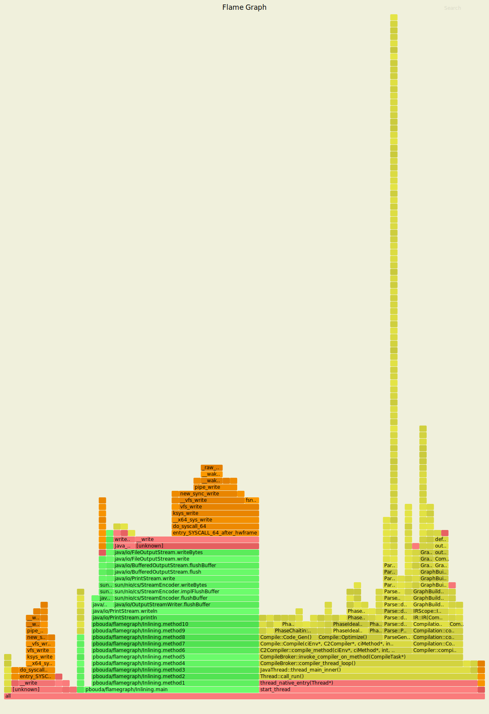
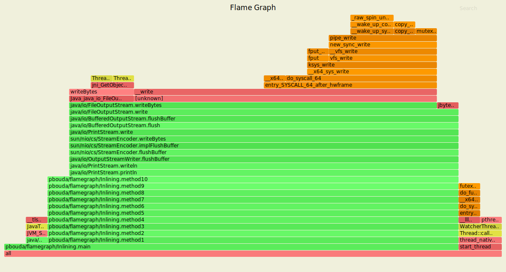

# ASYNC_PROFILER

- https://github.com/jvm-profiling-tools/async-profiler
- Does not require `-XX:+PreserveFramePointer` (in rare cases 10% CPU penalty)
- Does not require writing out `perf.data` and post processing with post-processing with `perf record`
- Does not require using folding and generating FlameGraphs manually with https://github.com/brendangregg/FlameGraph
- Works with Interpreter frames
- Option to merge all threads together (not only across all thread - simpler visualization)
- It's better to use `-XX:+UnlockDiagnosticVMOptions -XX:+DebugNonSafepoints` 
```
When agent is not loaded at JVM startup (by using -agentpath option) it is highly recommended to use 
-XX:+UnlockDiagnosticVMOptions -XX:+DebugNonSafepoints JVM flags. Without those flags the profiler will 
still work correctly but results might be less accurate e.g. without -XX:+DebugNonSafepoints there is a 
high chance that simple inlined methods will not appear in the profile. When agent is attached at runtime 
CompiledMethodLoad JVMTI event enables debug info, but only for methods compiled after the event is turned on.
```
- Supports inlined methods (but without any highlighting - it's not supported by `AsyncGetCallTrace`)

#### ASYNC_PROFILER WITH DEBUG_NON_SAFEPOINTS
```
# Run an application
java -XX:+UnlockDiagnosticVMOptions -XX:+DebugNonSafepoints -cp ./target/classes pbouda.flamegraph.Inlining

# Profiling
profiler.sh -d 30 -e cpu -f with-debugnonsafepoints.svg $(pgrep -f Inlining) 
```


#### ASYNC_PROFILER WITH DEBUG_NON_SAFEPOINTS
- Profiler gets connected after all inlining happened
- We can see the difference in the yellow part (JVM) that contains a lot of Compiler's stuff
```
# Run an application
java -XX:+UnlockDiagnosticVMOptions -XX:+PrintInlining -cp ./target/classes pbouda.flamegraph.Inlining

# Profiling
profiler.sh -d 30 -e cpu -f without-debugnonsafepoints.svg $(pgrep -f Inlining) 
```


```
                             @ 1   pbouda.flamegraph.Inlining::method2 (5 bytes)   inline
           @ 1   pbouda.flamegraph.Inlining::method3 (5 bytes)   inline
                                  @ 1   pbouda.flamegraph.Inlining::method4 (5 bytes)Iteration: 537
@ 1   pbouda.flamegraph.Inlining::method5 (5 bytes)   inline
  @ 1   pbouda.flamegraph.Inlining::method6 (5 bytes)Iteration: 543
      @ 1   pbouda.flamegraph.Inlining::method7Iteration: 546
 pbouda.flamegraph.Inlining::method8 (5 bytes)   inline
        @ 1   pbouda.flamegraph.Inlining::Iteration: 553
@ 1   pbouda.flamegraph.Inlining::method10 (13 bytes)Iteration: 557
 pbouda.flamegraph.Inlining::method3 (5 bytes)   inline
 pbouda.flamegraph.Inlining::method4 (5 bytes)   inline
  @ 1   pbouda.flamegraph.Inlining::method5 (5 bytes)Iteration: 575
  @ 1   pbouda.flamegraph.Inlining::method6 (5 bytes)Iteration: 578
    @ 1   pbouda.flamegraph.Inlining::method7Iteration: 581
 pbouda.flamegraph.Inlining::method8 (5 bytes)   inlineIteration: 585
      @ 1   pbouda.flamegraph.Inlining::Iteration: 588
@ 1   pbouda.flamegraph.Inlining::method10 (13 bytes)Iteration: 592
                              @ 1   pbouda.flamegraph.Inlining::method4 (5 bytes)   inline
                                @ 1   pbouda.flamegraph.Inlining::method5 (5 bytes)   inline
                                  @ 1   pbouda.flamegraph.Inlining::method6 (5 bytes)   inline
                                    @ 1   pbouda.flamegraph.Inlining::method7 (5 bytes)   inline
                                      @ 1   pbouda.flamegraph.Inlining::method8 (5 bytes)   inline
                                        @ 1   pbouda.flamegraph.Inlining::method9 (5 bytes)   inline
                                          @ 1   pbouda.flamegraph.Inlining::method10 (13 bytes)   inline
                              @ 1   pbouda.flamegraph.Inlining::method5 (5 bytes)   inline
                                @ 1   pbouda.flamegraph.Inlining::method6 (5 bytes)   inline
                                  @ 1   pbouda.flamegraph.Inlining::method7 (5 bytes)   inline
                                    @ 1   pbouda.flamegraph.Inlining::method8 (5 bytes)   inline
                                      @ 1   pbouda.flamegraph.Inlining::method9 (5 bytes)   inline
                                        @ 1   pbouda.flamegraph.Inlining::method10 (13 bytes)   inline
                              @ 1   pbouda.flamegraph.Inlining::method6 (5 bytes)   inline
                                @ 1   pbouda.flamegraph.Inlining::method7 (5 bytes)   inline
                                  @ 1   pbouda.flamegraph.Inlining::method8 (5 bytes)   inline
                                    @ 1   pbouda.flamegraph.Inlining::method9 (5 bytes)   inline
                                      @ 1   pbouda.flamegraph.Inlining::method10 (13 bytes)   inline
                              @ 1   pbouda.flamegraph.Inlining::method7 (5 bytes)   inline
                                @ 1   pbouda.flamegraph.Inlining::method8 (5 bytes)   inline
                                  @ 1   pbouda.flamegraph.Inlining::method9 (5 bytes)   inline
                                    @ 1   pbouda.flamegraph.Inlining::method10 (13 bytes)   inline
                              @ 1   pbouda.flamegraph.Inlining::method8 (5 bytes)   inline
                                @ 1   pbouda.flamegraph.Inlining::method9 (5 bytes)   inline
                                  @ 1   pbouda.flamegraph.Inlining::method10 (13 bytes)   inline
                              @ 1   pbouda.flamegraph.Inlining::method2 (5 bytes)   inline (hot)
                                @ 1   pbouda.flamegraph.Inlining::method3 (5 bytes)   inline (hot)
                                  @ 1   pbouda.flamegraph.Inlining::method4 (5 bytes)   inline (hot)
                                    @ 1   pbouda.flamegraph.Inlining::method5 (5 bytes)   inline (hot)
                                      @ 1   pbouda.flamegraph.Inlining::method6 (5 bytes)   inline (hot)
                                        @ 1   pbouda.flamegraph.Inlining::method7 (5 bytes)   inline (hot)
                                          @ 1   pbouda.flamegraph.Inlining::method8 (5 bytes)   inline (hot)
                                            @ 1   pbouda.flamegraph.Inlining::method9 (5 bytes)   inline (hot)
                                              @ 1   pbouda.flamegraph.Inlining::method10 (13 bytes)   inline (hot)

```

#### ASYNC_PROFILER NON-INLINABLE

- the profiler is get connected after the lock with inlining appears


```
# Run an application with enabled printing of inline methods
java -XX:+UnlockDiagnosticVMOptions -XX:+PrintInlining -cp ./target/classes pbouda.flamegraph.Inlining | grep pbouda

# Profiling
profiler.sh -d 30 -e cpu -f inlining.svg $(pgrep -f Inlining) 
```

```
               !              @ 2   pbouda.flamegraph.Encrypt::encrypt (68 bytes)   callee is too large
                              @ 7   pbouda.flamegraph.Inlining::method2 (11 bytes)   inline
               !                @ 2   pbouda.flamegraph.Encrypt::encrypt (68 bytes)   callee is too large
                                @ 7   pbouda.flamegraph.Inlining::method3 (11 bytes)   inline
               !                  @ 2   pbouda.flamegraph.Encrypt::encrypt (68 bytes)   callee is too large
                                  @ 7   pbouda.flamegraph.Inlining::Iteration: 261
               !                    @ 2   pbouda.flamegraph.Encrypt::encrypt (68 bytes)   callee is too large
                                    @ 7   pbouda.flamegraph.Inlining::method5 (11 bytes)   inline
               !                      @ 2   pbouda.flamegraph.Encrypt::encrypt (68 bytes)   callee is too large
                                      @ 7   pbouda.flamegraph.Inlining::method6 (11 bytes)   inline
               !                        @ 2   pbouda.flamegraph.Encrypt::encrypt (68 bytes)   callee is too large
                                        @ 7   pbouda.flamegraph.Inlining::method7 (11 bytes)   inline
       !                          @ 2   pbouda.flamegraph.Encrypt::encrypt (68 bytes)   callee is too large
                                          @ 7   pbouda.flamegraph.Inlining::method8 (11 bytes)   inline
               !                            @ 2   pbouda.flamegraph.Encrypt::encrypt (68 bytes)   callee is too large
                                            @ 7   pbouda.flamegraph.Inlining::method9 (11 bytes)   inline
               !                              @ 2   pbouda.flamegraph.Encrypt::encrypt (68 bytes)   callee is too large
                                              @ 7   pbouda.flamegraph.Inlining::method10 (19 bytes)   callee is too large
               !              @ 2   pbouda.flamegraph.Encrypt::encrypt (68 bytes)   callee is too large
               !              @ 2   pbouda.flamegraph.Encrypt::encrypt (68 bytes)   already compiled into a big method
                              @ 7   pbouda.flamegraph.Inlining::method2 (11 bytes)   inline (hot)
               !                @ 2   pbouda.flamegraph.Encrypt::encrypt (68 bytes)   already compiled into a big method
                                @ 7   pbouda.flamegraph.Inlining::method3 (11 bytes)   inline (hot)
               !                  @ 2   pbouda.flamegraph.Encrypt::encrypt (68 bytes)   already compiled into a big method
                                  @ 7   pbouda.flamegraph.Inlining::method4 (11 bytes)   inline (hot)
               !                    @ 2   pbouda.flamegraph.Encrypt::encrypt (68 bytes)   already compiled into a big method
                                    @ 7   pbouda.flamegraph.Inlining::method5 (11 bytes)   inline (hot)
               !                      @ 2   pbouda.flamegraph.Encrypt::encrypt (68 bytes)   already compiled into a big method
                                      @ 7   pbouda.flamegraph.Inlining::method6 (11 bytes)   inline (hot)
               !                        @ 2   pbouda.flamegraph.Encrypt::encrypt (68 bytes)   already compiled into a big method
                                        @ 7   pbouda.flamegraph.Inlining::method7 (11 bytes)   inline (hot)
               !                          @ 2   pbouda.flamegraph.Encrypt::encrypt (68 bytes)   already compiled into a big method
                                          @ 7   pbouda.flamegraph.Inlining::method8 (11 bytes)   inline (hot)
               !                            @ 2   pbouda.flamegraph.Encrypt::encrypt (68 bytes)   already compiled into a big method
                                            @ 7   pbouda.flamegraph.Inlining::method9 (11 bytes)   inline (hot)
               !                              @ 2   pbouda.flamegraph.Encrypt::encrypt (68 bytes)   already compiled into a big method
                                              @ 7   pbouda.flamegraph.Inlining::method10 (19 bytes)   inline (hot)
               !                                @ 2   pbouda.flamegraph.Encrypt::encrypt (68 bytes)   already compiled into a big method
               !              @ 2   pbouda.flamegraph.Encrypt::encrypt (68 bytes)   already compiled into a big method

```
