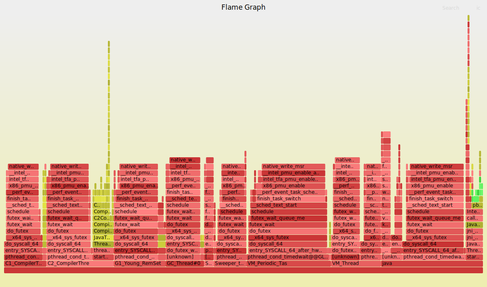

# PERF_JAVA_FLAMES

- https://github.com/jvm-profiling-tools/perf-map-agent
- It's supposed to work better with inlined method - aqua highlighting (unfortunately, not in my example)
- It might be a better result in case of a longer running application

```
# Run an application
java -XX:+UnlockDiagnosticVMOptions -XX:+DebugNonSafepoints -XX:+PreserveFramePointer -cp ./target/classes pbouda.flamegraph.Inlining

# Run a profiler
export PERF_RECORD_SECONDS=30 && PERF_RECORD_FREQ=49
perf-java-flames $(pgrep -f Inlining) -g
```

