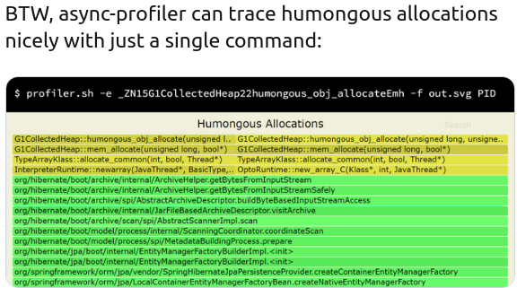
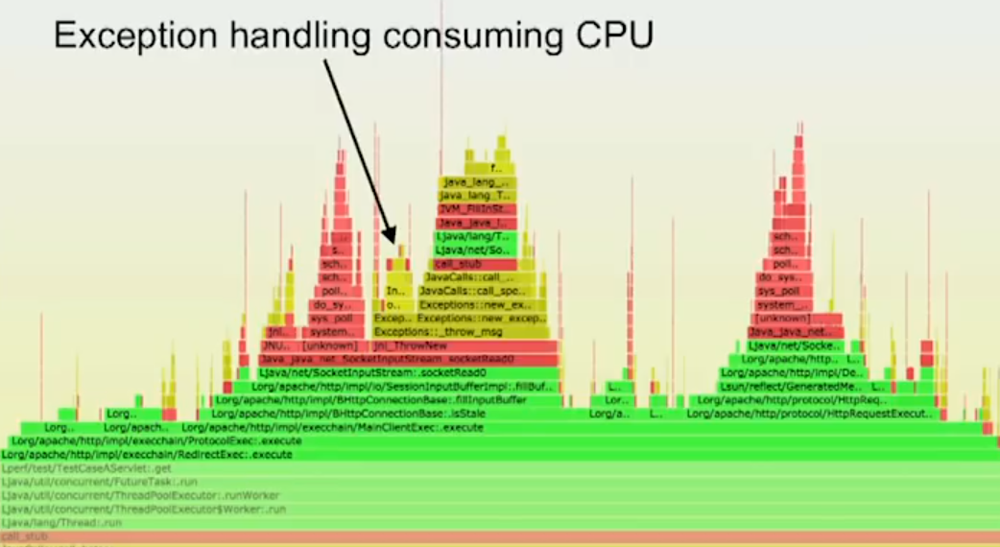
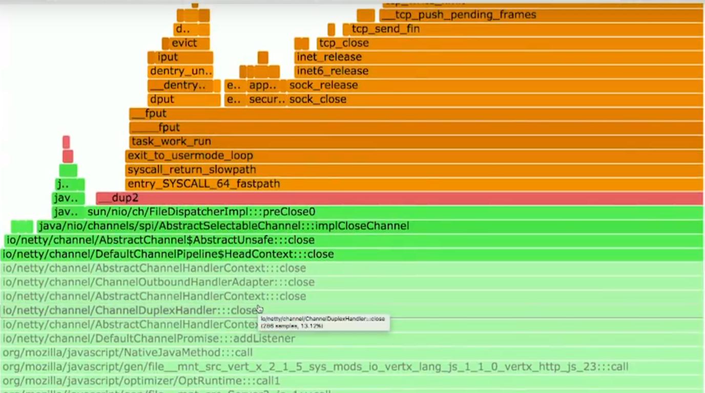
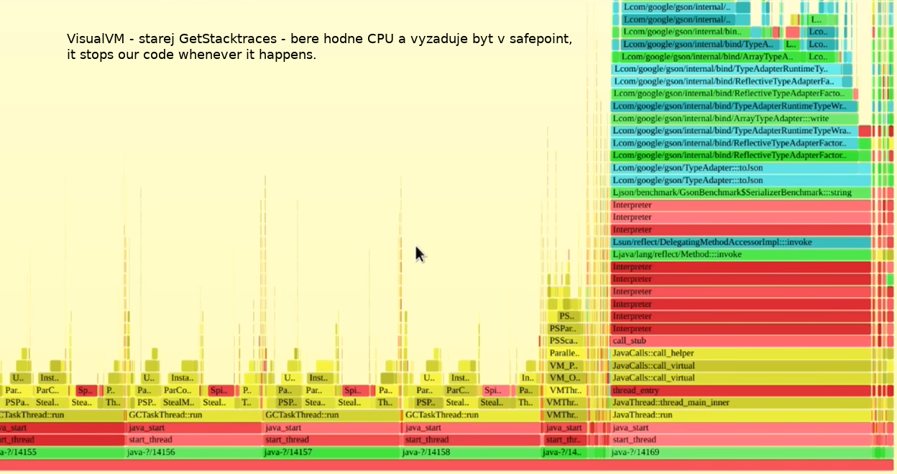
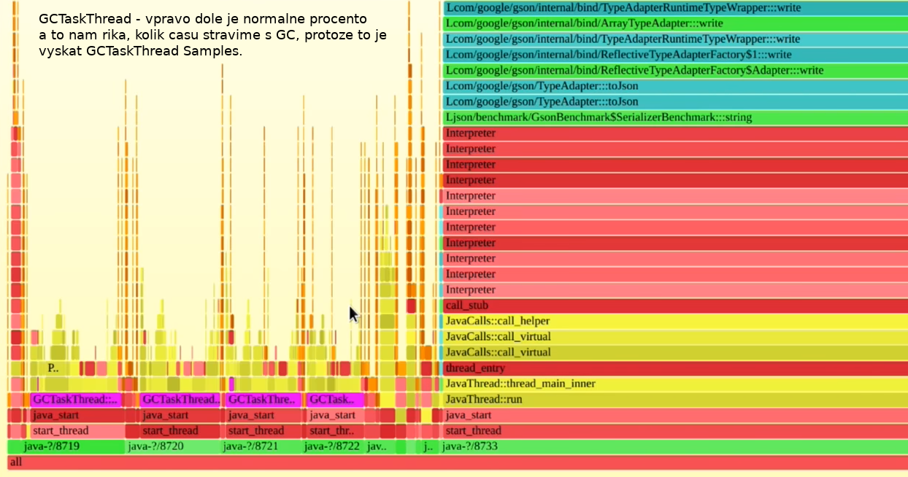
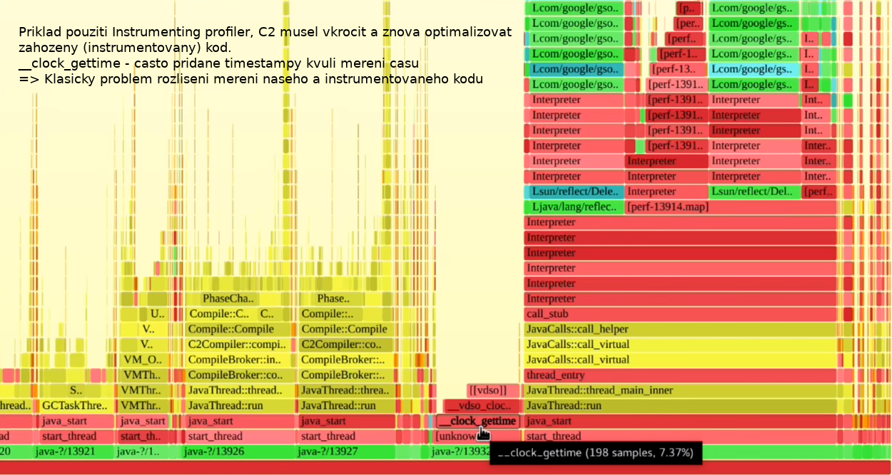
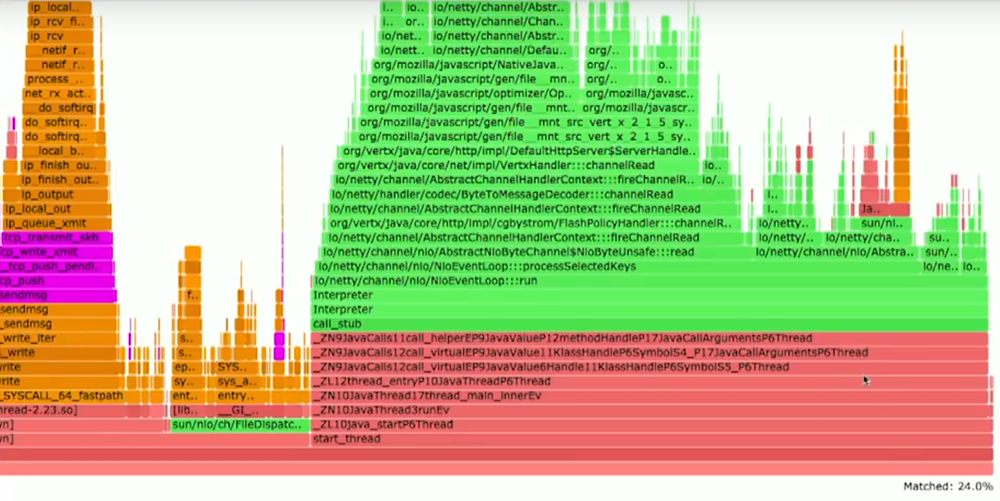
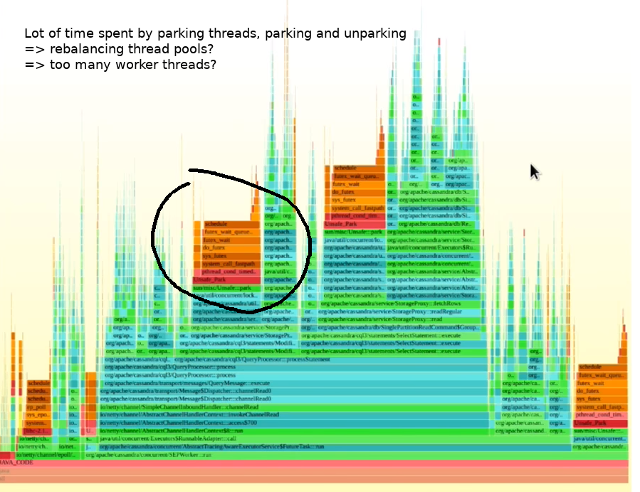

# FLAMEGRAPH_PLAYGROUND

### Presentation 

- Sasha Goldshtein: [GOLDSHTEIN_SLIDES.md](GOLDSHTEIN_SLIDES.pdf)
- Andrei Pangin: [PANGIN_SLIDES.md](PANGIN_SLIDES.pdf)

### Inlining

https://www.baeldung.com/jvm-method-inlining

### FlameGraphs
https://github.com/brendangregg/FlameGraph
https://github.com/jvm-profiling-tools/async-profiler
https://medium.com/@maheshsenni/java-performance-profiling-using-flame-graphs-e29238130375
https://www.slideshare.net/brendangregg/java-performance-analysis-on-linux-with-flame-graphs

### PERF
https://perf.wiki.kernel.org/index.php/Tutorial
http://www.brendangregg.com/perf.html
https://shuheikagawa.com/blog/2018/09/16/node-js-under-a-microscope/

### PERF-MAP-AGENT
https://github.com/jvm-profiling-tools/perf-map-agent

- [ASYNC_PROFILER.md](ASYNC_PROFILER.md)
- [PERF](PERF.md)
- [PERF_JAVA_FLAMES](PERF_JAVA_FLAMES.md)

### FramePointer

[FRAME_POINTERS](FRAMEPOINTERS.md)

```
-XX:+PreserveFramePointer 

Selects between using the RBP register as a general purpose register (-XX:-PreserveFramePointer) 
and using the RBP register to hold the frame pointer of the currently executing method 
(-XX:+PreserveFramePointer). If the frame pointer is available, then external 
profiling tools (for example, Linux perf) can construct more accurate stack traces.
```

### De-optimization

- A process of replacing Compiled frames with Interpreter frames right on the Java stack on a running application.
- It happens in the context of a running Java Thread - trashes the currently running stack.
- It could cause not-walkable stack in the middle of this process.
- Use Java Flight Recorder to catch this:

```
jdk.Deoptimization {
  startTime = 12:33:57.271
  compileId = 1655
  compiler = "c2"
  method = jdk.jfr.internal.EventWriter.putStackTrace()
  lineNumber = 170
  bci = 7
  instruction = "ifeq"
  reason = "unstable_if"
  action = "reinterpret"
  eventThread = "JFR Periodic Tasks" (javaThreadId = 22)
  stackTrace = [
    jdk.jfr.internal.EventWriter.putStackTrace() line: 170
    jdk.jfr.internal.handlers.EventHandler1872_1577964835419-26342.write(long, long, long)
    jdk.jfr.events.ExceptionStatisticsEvent.commit()
    jdk.jfr.internal.instrument.JDKEvents.emitExceptionStatistics() line: 136
    jdk.jfr.internal.instrument.JDKEvents$$Lambda$37.1361501771.run()
    ...
  ]
}
```

## Extras - Async-Profiler 

#### Humongous Allocation



#### Exception Throwing



#### Closing a Connection



#### Attaching VisualVM



#### GC Threads



#### Code Instrumentation / GET_TIME to measure the instrumented time



#### Matched Time 



#### Thread Parking/Un-parking



